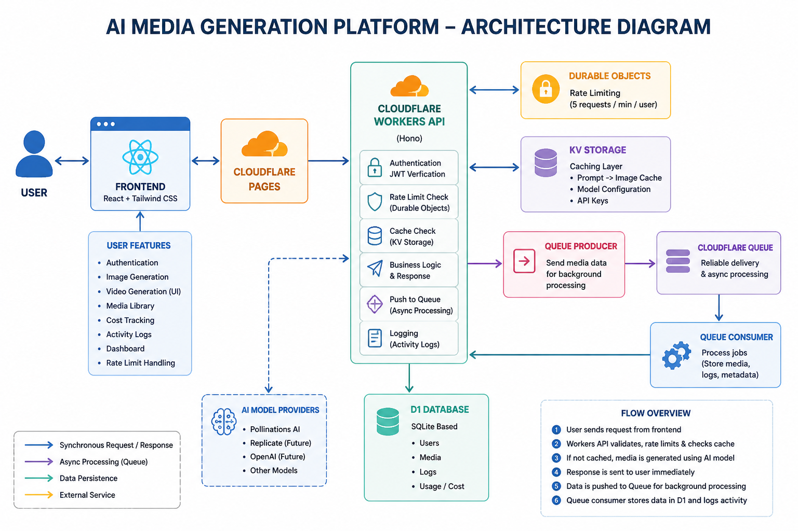

# 🚀 AI Media Generation Platform

A full-stack **AI-powered media generation platform** built using the **Cloudflare ecosystem**.
This project demonstrates how to design and deploy a scalable AI SaaS application using modern serverless technologies.

---

## 🎥 Demo Video

👉 https://drive.google.com/file/d/1AfanSsb9DDpw11VFxne8RqCV9OwJ_sOV/view?usp=sharing

---

## 🌐 Live Deployment

* **Frontend (Cloudflare Pages):** https://ai-media-generator.pages.dev
* **Backend (Cloudflare Workers):** https://backend-api.laxman-sg0104.workers.dev

---

## ✨ Key Features

### 🔐 Authentication System

* Token-based login system
* Secure user session handling
* User-specific data isolation

---

### 🎨 AI Image Generation

* Generate images using text prompts
* Dynamic model selection
* Instant response with background processing
* Cached results for repeated prompts

---

### 🎬 Video Generation (UI)

* Script-based input
* Duration & audio selection
* Extendable for real video AI APIs

---

### 🖼️ Media Library

* Displays all generated media
* Shows:

  * Prompt
  * Model used
  * Cost
* Clean and responsive UI

---

### ⚙️ Multi-Model Integration

* Dynamic model configuration from backend
* Supports multiple providers
* KV-based API key storage
* Easily extendable architecture

---

### 💰 Cost Tracking System

* Tracks:

  * Model used
  * Cost per generation
* Dashboard shows:

  * Total usage
  * Total generations

---

### ⚡ KV Caching Layer

* Model configuration caching
* Prompt-based caching
* Faster responses and reduced API calls

---

### 🔁 Queue-Based Background Processing

* Asynchronous workflow using Cloudflare Queues
* Improves performance and scalability

**Flow:**

1. User sends request
2. API responds instantly
3. Data sent to queue
4. Queue stores data in DB

---

### 🚦 Rate Limiting (Durable Objects)

* Max **5 requests per minute per user**
* Prevents abuse and ensures fair usage

---

### 📊 Activity Logs Dashboard

Tracks:

* API usage
* Media generation
* Cache hits
* Errors

---

## 🏗️ Architecture


---

## 🧰 Tech Stack

### Frontend

* React.js
* TailwindCSS
* Framer Motion

### Backend

* Cloudflare Workers (Hono framework)
* D1 (SQLite-based database)
* KV (Key-value storage for caching & API keys)
* Queues (background processing)
* Durable Objects (stateful rate limiting)

---

## 📂 Project Structure

```
AI_Media_Generation_Platform/
│
├── backend-api/
│   ├── src/
│   ├── migrations/
│   └── wrangler.json
│
├── frontend/
│   ├── src/components/
│   ├── pages/
│   └── dist/
│
└── README.md
```

---

## ⚙️ How It Works

### 🔄 Workflow

1. User enters prompt in frontend
2. Request sent to Cloudflare Worker API
3. Rate limiting is checked
4. KV cache is checked:

   * If found → return instantly
   * Else → generate new media
5. Response sent to frontend
6. Data pushed to queue
7. Queue processes and stores data in D1
8. Logs are recorded for tracking

---

## 🚀 Deployment

### Backend (Workers)

```bash
npx wrangler deploy
```

### Frontend (Pages)

```bash
npm run build
npx wrangler pages deploy dist
```

---

## 🧠 Key Concepts Implemented

* Serverless architecture
* Event-driven processing (Queues)
* Distributed caching (KV)
* Stateful logic (Durable Objects)
* Multi-model abstraction layer
* Activity logging & monitoring

---

## 🔮 Future Enhancements

* Real video generation integration
* PDF export support
* Advanced analytics dashboard
* Custom domain configuration
* AI prompt enhancement

---

## 👨‍💻 Author

**Laxman Sannu Gouda**

---

## 📜 License

This project is developed for learning and demonstration purposes.

[1]: https://developers.cloudflare.com/workers/?utm_source=chatgpt.com "Overview · Cloudflare Workers docs"
[2]: https://oneuptime.com/blog/post/2026-01-28-cloudflare-workers-ai/view?utm_source=chatgpt.com "How to Use Cloudflare Workers AI"
